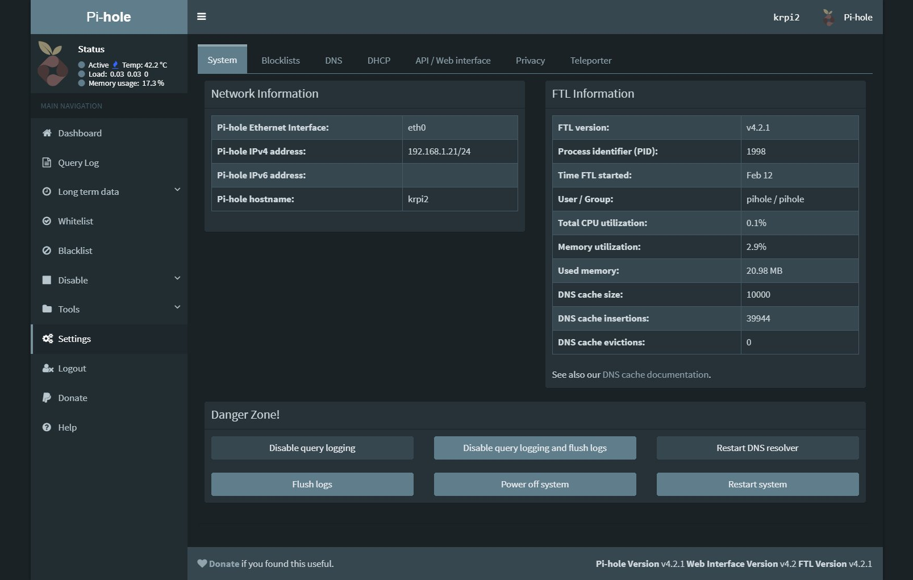

# pihole_admin_darktheme
Dark theme for the pihole admin interface

**How to use:**

Just replace the skin-blue.min.css file in the admin/style/vendor directory with the one in this repository.

**Screenshot:**

